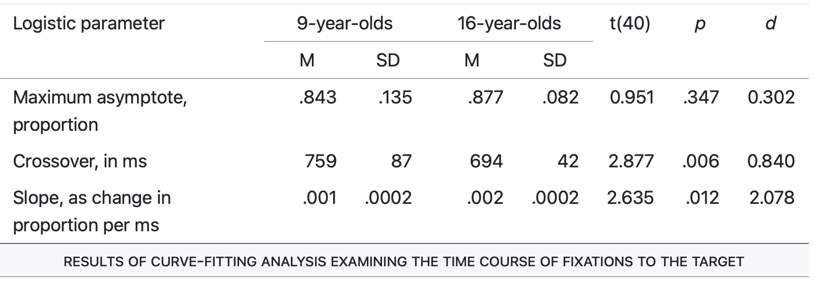
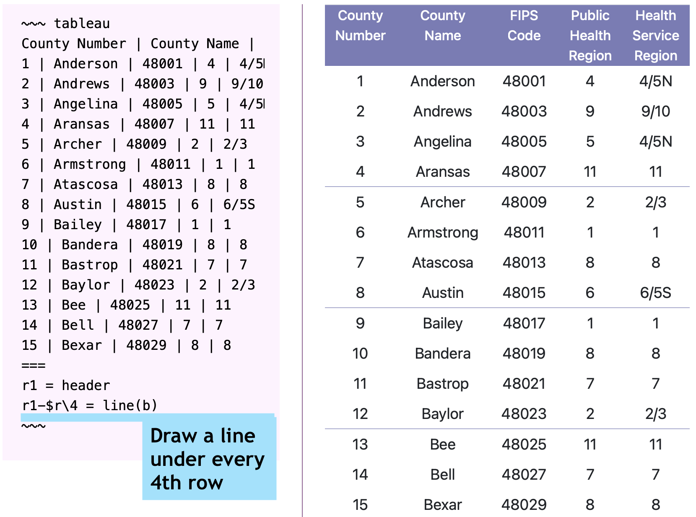
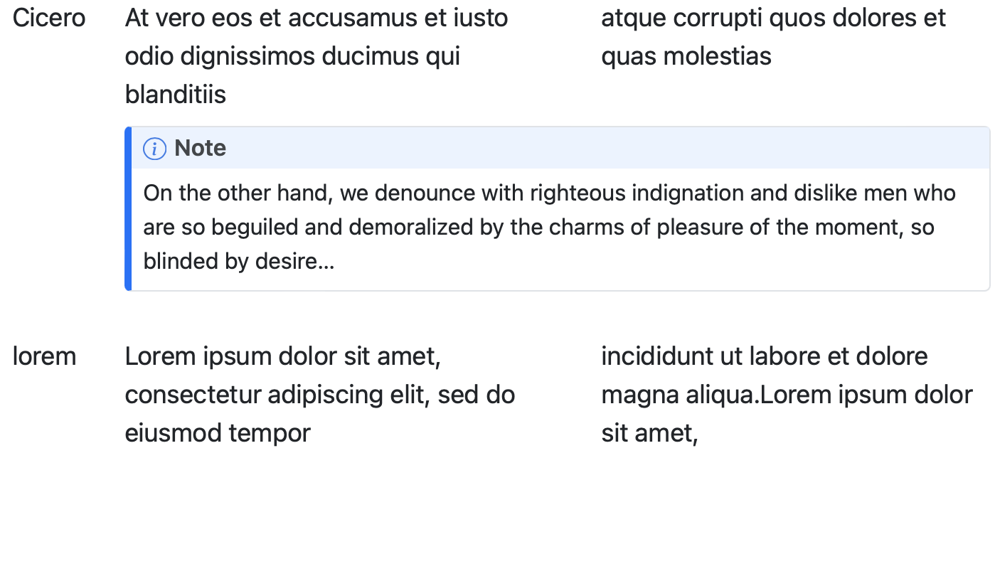
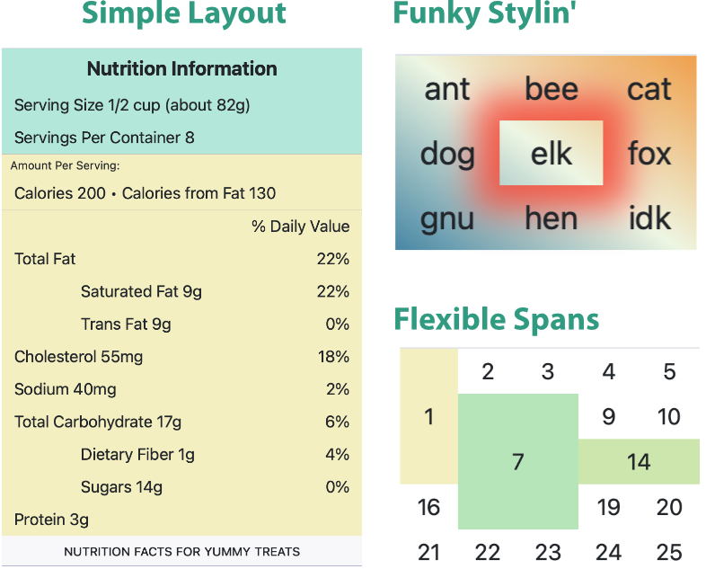
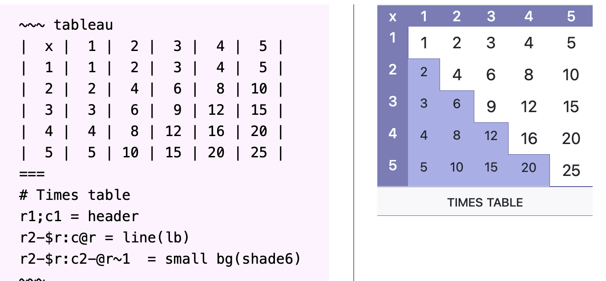

# Tableau: Enhanced Markdown Tables for Quarto

Tableau is a Quarto extension that simplifies table layout by separating
data from layout.

Here are some sample tables:

* Easy spans, partial underlines

  

* Different heading styles
* Lines under every _n_ rows

  

* Block level cell content (single cell and spanned)

  

* Nontraditional layout

  

The layout language is vaguely dynamic. The following example shows the
markup on the left and the result on the right. The layout section uses
the special variables `$r` (the number of rows), and `@r` (the current
row being generated. It also does arithmetic.

## Status

* HTML generation: working
* PDF generation:
  * prototype/poc working
  * development starting

## Documentation

A combined guide and reference [is available](https://pragdave.github.io/pandoc-tableau/tableau-guide.html).

## Installation

The Tableau extension is available in the `_extensions` directory.

## Adding to Your Document

This extension must be run prior to the bulk of Quarto processing. Add
it to your `_quarto.yml` file like this:

~~~ yml
filters:
  - _extensions/tableau_pre/tableau_pre.lua
  - quarto
  - other_filters_go_here
~~~

You'll need to add the `tableau_pre` extension at the top of your
filters, and then add the `- quarto` line (if it isn't already there).
This second line tells Quarto where in the filter chain it should run.

## Using

See [the guide](https://pragdave.github.io/pandoc-tableau/tableau-guide.html).

### License

Copyright © 2023, Dave Thomas (pragdave)

See [LICENSE.md](./LICENSE.md)
